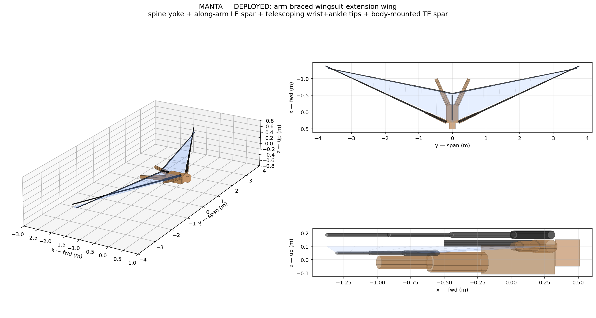

# MANTA

A wingsuit-extension rigid wing. Pilot wears a fitted wingsuit-derivative
harness with an integrated CFRP spine yoke. Arm-aligned spars hinge from
the spine at the shoulders and brace into position as the pilot spreads
to a flight pose. Telescoping tip extensions snap out from the wrists; a
body-mounted TE spar telescopes spanwise from a hub at the lower back.
Deployable rapidly in flight or on the ground.

This is a real flight vehicle program. Read [`BRIEF.md`](BRIEF.md) before
touching anything else.

**Live project site:** <https://manta-ten.vercel.app>



## Status

Architecture rebuilt (see [BRIEF v2](BRIEF.md)). The first-cut analyses
across deliverables #1–#6 hold against the corrected architecture; the
wing geometry numbers are independent of how it integrates with the
pilot. CAD and viewer have been rebuilt from scratch around the
arm-braced wingsuit-extension concept.

| BRIEF Deliverable | Doc | Analysis | Tests | Status |
|---|---|---|---|---|
| #1 Aero sizing | [`docs/01`](docs/01-aero-sizing.md) | [`aero/`](analysis/aero/) | 5 ✓ | first-cut |
| #2 Mass budget | [`docs/02`](docs/02-structural-budget.md) | [`struct/mass_budget.py`](analysis/struct/mass_budget.py) | 8 ✓ | first-cut |
| #3 Spar bending | [`docs/02`](docs/02-structural-budget.md) | [`struct/spar_bending.py`](analysis/struct/spar_bending.py) | 8 ✓ | first-cut — load path needs update for arm-braced architecture |
| #4 Deployment sequence | [`docs/03`](docs/03-deployment-sequence.md) | [`deployment/state_machine.py`](analysis/deployment/state_machine.py) | 7 ✓ | first-cut — phases A-B-D added in BRIEF v2 |
| #5 Symmetry budget | [`analysis/deployment/symmetry-budget.md`](analysis/deployment/symmetry-budget.md) | [`deployment/symmetry_budget.py`](analysis/deployment/symmetry_budget.py) | — | first-cut |
| #6 Ground rig spec | [`test/ground/spec.md`](test/ground/spec.md) | — | — | spec drafted — needs update for new kinematics |
| (also) FCS + alpha limiter | [`docs/04`](docs/04-fcs-architecture.md) | [`fcs/`](fcs/) | 7 ✓ | first-cut |
| (also) FMEA | [`safety/fmea.md`](safety/fmea.md) | 11 per-mode files in [`safety/failure-modes/`](safety/failure-modes/) | — | first-cut — pyrotechnic-cutter rows obsolete in BRIEF v2 |
| (also) CAD (corrected) | [`cad/build.py`](cad/build.py) | [`cad/render.py`](cad/render.py) | — | parametric, single source of truth |

> 27 / 27 tests passing. Full suite: `make test`. Site auto-deploys via GitHub Actions on every push touching `site/**`.

## Architecture

Per [`BRIEF.md`](BRIEF.md):

- **Pilot is the fuselage.** Body horizontal in flight, head forward.
- **Spine yoke** (CFRP backbone in the harness) along the back; spar pivots at shoulder + lower-back hub.
- **LE spar** along each arm (shoulder → wrist) with the arm fitted alongside; the spar carries bending load, the arm provides shape and control input.
- **Wrist tip extension** — 3-stage telescoping CFRP from the wrist outward to the wingtip LE.
- **TE spar** — body-mounted spanwise boom from a hub at the lower back, 3-stage telescoping to the wingtip TE. Does not run along the leg (geometric constraint: leg sweep doesn't match TE sweep).
- **Bistable CFRP tape-spring ribs** chordwise between LE and TE spars at multiple span stations.
- **DCF skin** spans LE-to-TE, anchored at body, arms, legs, and tips.
- **Reserve canopy** mounted on the back. After tip-extension retract OR yoke-pivot release, structure folds clear of the reserve cone.
- **Pilot retains wingsuit mode** — if the rigid extensions are fully retracted, the pilot is in a fabric-wingsuit configuration with normal canopy descent capability. That's the architectural fallback.

## Open architecture-amendment findings

1. **V_bg ≈ 16 m/s, not 25 m/s** — wing's natural best-glide is ~16 m/s with the locked planform.
2. **Front spar must grow** to 73 mm OD root, 2.5 mm wall — bending analysis surfaced the original spec failed at 3 g limit. Now relevant to the LE-spar root cross-section.
3. **Active per-side flow modulation** required to close the 10 ms 3-σ symmetry budget.
4. **Architecture is wingsuit-extension, not aircraft-on-back** (BRIEF v2). The prior assumption (separate aircraft on top of a piggyback rig with pyrotechnic spar-root cutters) was wrong; the actual concept is the arm-braced wing. CAD, viewer, and integration are rebuilt around this.

## Reproducibility

```sh
make venv          # one-time setup of .venv
make aero          # planform → Weissinger → trim → glide polar
make struct        # spar bending + mass budget
PYTHONPATH=. .venv/bin/python cad/build.py    # parametric CAD (STL + STEP per part)
PYTHONPATH=. .venv/bin/python cad/render.py   # static iso/top/side hero renders
make test          # full pytest suite
```

Site:

```sh
cd site && bun install && bun run dev    # local preview
cd site && bun run build                  # static build to dist/
```

## Engineering bar

> Would this analysis hold up if a coroner's office asked for it?

If no, it isn't done.

## Where things live

| Path | What's there |
|---|---|
| [`BRIEF.md`](BRIEF.md) | The brief (v2 — wingsuit-extension architecture). |
| [`docs/`](docs/) | Numbered design documents (rationale → aero → structure → deployment → FCS → emergency → test plan → pilot training). |
| [`analysis/`](analysis/) | Quantitative analysis: aero, struct, deployment, flight dynamics. Reproducible via `make`. |
| [`cad/`](cad/) | Single parametric build at `cad/build.py`. Outputs per-part STLs to `cad/out/parts/`. |
| [`fcs/`](fcs/) | Flight control: alpha limiter, SITL simulator, envelope-protection unit tests. |
| [`test/`](test/) | Test article specifications: bench characterization, ground deployment rig, tow article, drop article. |
| [`safety/`](safety/) | FMEA, reserve-parachute compatibility, per-failure-mode write-ups. |
| [`site/`](site/) | Astro + Tailwind + R3F static site. Auto-deploys to manta-ten.vercel.app. |
