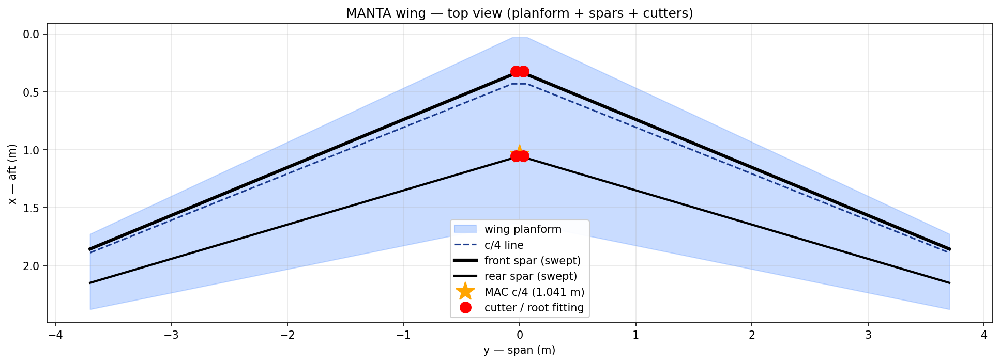
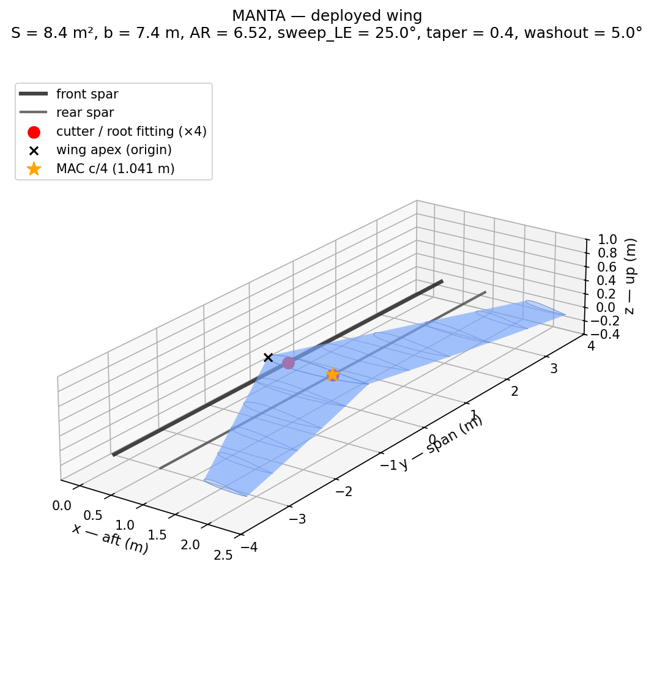
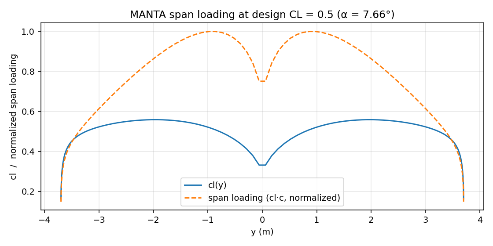
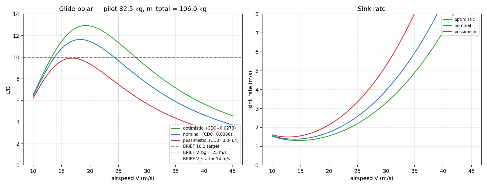
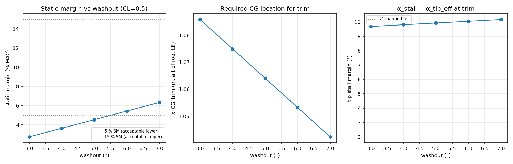
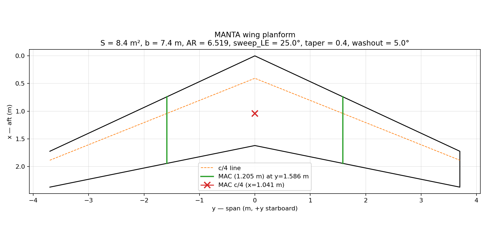
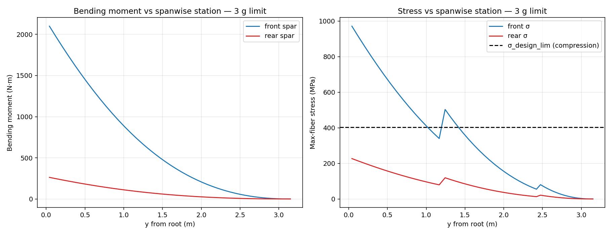
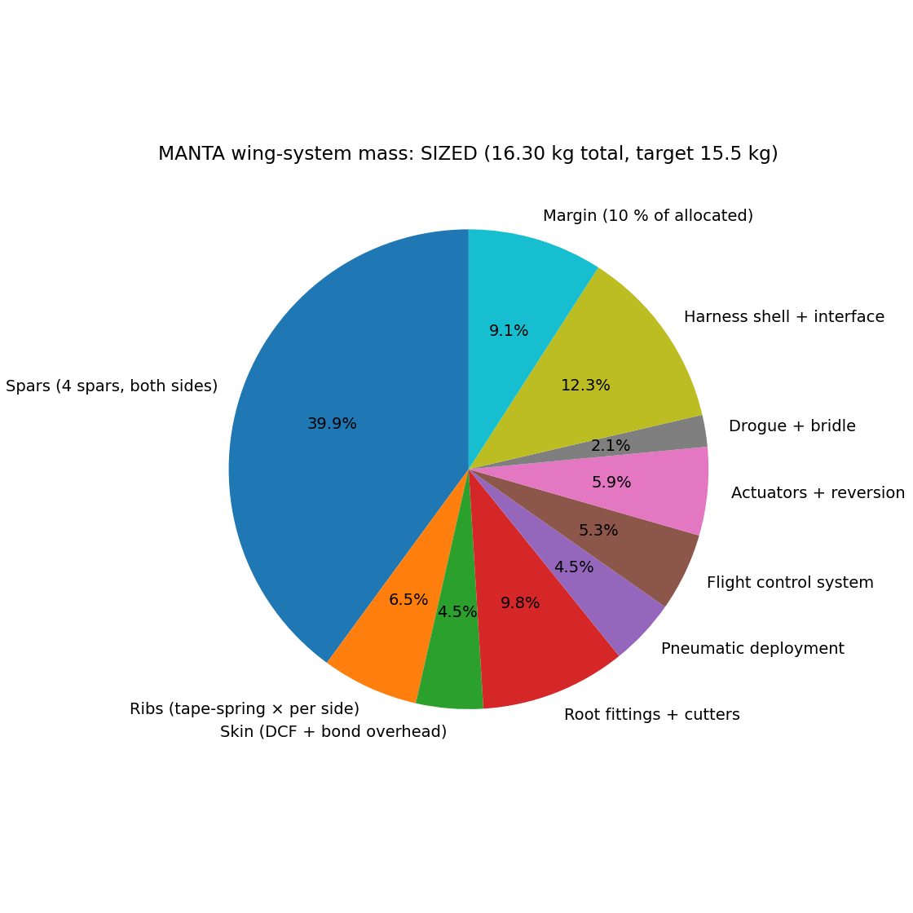
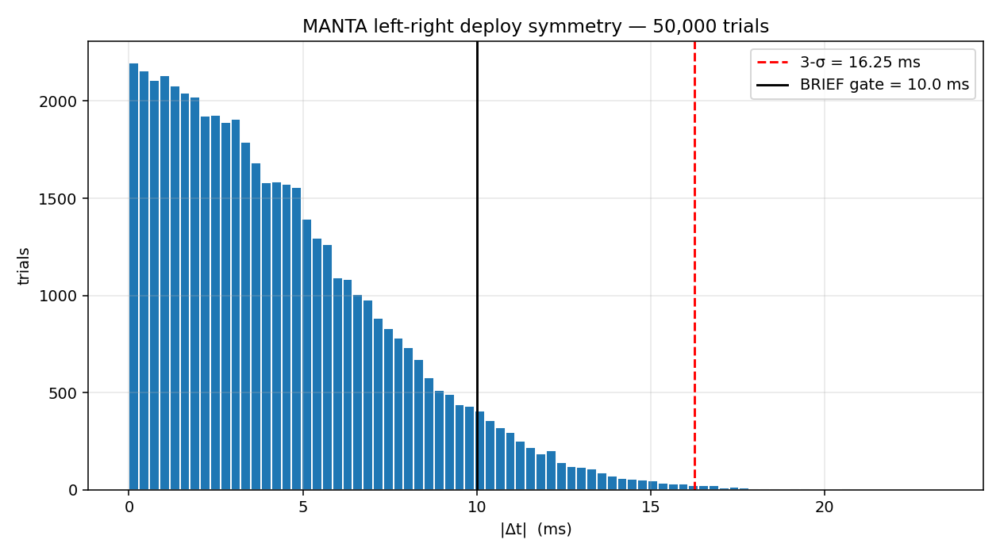
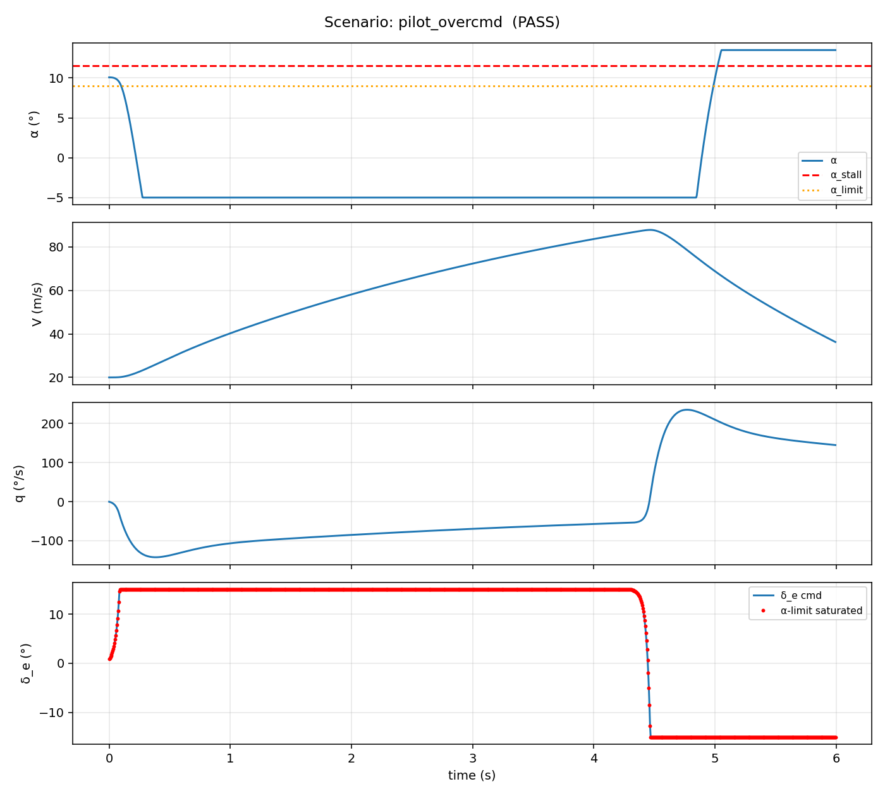

# MANTA

A deployable rigid-wing personal flight system. Pilot-worn airframe — telescoping CFRP spars + bistable tape-spring ribs — that snaps from a body-conformal stowed state into a high-aspect-ratio swept flying wing in flight. Target: hang-glider-class glide (10:1) from a wingsuit-class form factor.

This is a real flight vehicle program. Read [`BRIEF.md`](BRIEF.md) before touching anything else.

**Live project site:** <https://manta-ten.vercel.app>



## Status

First-cut analysis closed end-to-end across all 6 BRIEF priority deliverables. Three architecture findings that need a design decision before flight-relevant articles are built (see "Open architecture decisions" below).

| BRIEF Deliverable | Doc | Analysis | Tests | CAD | Status |
|---|---|---|---|---|---|
| #1 Aero sizing | [`docs/01`](docs/01-aero-sizing.md) | [`aero/`](analysis/aero/) | 5 ✓ | [`cad/wing`](cad/wing/) | first-cut |
| #2 Mass budget | [`docs/02`](docs/02-structural-budget.md) | [`struct/mass_budget.py`](analysis/struct/mass_budget.py) | 8 ✓ | [`cad/spars`](cad/spars/) | first-cut |
| #3 Spar bending | [`docs/02`](docs/02-structural-budget.md) | [`struct/spar_bending.py`](analysis/struct/spar_bending.py) | 8 ✓ | [`cad/spars`](cad/spars/) | first-cut |
| #4 Deployment sequence | [`docs/03`](docs/03-deployment-sequence.md) | [`deployment/state_machine.py`](analysis/deployment/state_machine.py) | 7 ✓ | [`cad/jettison`](cad/jettison/) | first-cut |
| #5 Symmetry budget | [`analysis/deployment/symmetry-budget.md`](analysis/deployment/symmetry-budget.md) | [`deployment/symmetry_budget.py`](analysis/deployment/symmetry_budget.py) | — | — | first-cut |
| #6 Ground rig spec | [`test/ground/spec.md`](test/ground/spec.md) | — | — | — | spec drafted |
| (also) FCS + alpha limiter | [`docs/04`](docs/04-fcs-architecture.md) | [`flightdynamics`](analysis/flightdynamics/), [`fcs`](fcs/) | 7 ✓ | [`cad/fcs`](cad/fcs/) | first-cut |
| (also) Lateral-directional dynamics | inside [`docs/04`](docs/04-fcs-architecture.md) | [`flightdynamics/lateral.py`](analysis/flightdynamics/lateral.py) | — | — | first-cut |
| (also) Drogue dynamics | inside [`docs/02`](docs/02-structural-budget.md) | [`deployment/drogue_dynamics.py`](analysis/deployment/drogue_dynamics.py) | — | — | first-cut |
| (also) Pilot training transition | [`docs/07`](docs/07-pilot-training.md) | — | — | — | syllabus drafted |
| (also) FMEA | [`safety/fmea.md`](safety/fmea.md) | 11 / 14 per-mode files in [`safety/failure-modes/`](safety/failure-modes/) | — | — | first-cut |
| (also) Bench characterization plan | [`test/bench/`](test/bench/) | per-article specs | — | — | spec drafted |

> 27 / 27 tests passing across `analysis/` and `fcs/`. Full suite: `make test`.

## Headline numbers (locked planform, sized spar)

| Quantity | Value | Source |
|---|---|---|
| Wing area S | 8.4 m² | BRIEF |
| Span b | 7.4 m | BRIEF |
| Aspect ratio | 6.52 | derived |
| Sweep / taper / washout | 25° / 0.4 / 6° | BRIEF + trim study |
| CL_α | 4.24 /rad | Weissinger |
| α at design CL = 0.5 | 7.7° | Weissinger |
| Neutral point | 0.928·MAC aft of apex | Weissinger |
| Static margin (design CL) | 5.4 % MAC | trim study |
| Best-glide L/D (nominal CD0) | **12.0 at V ≈ 16 m/s** | glide polar |
| L/D at BRIEF V = 25 m/s | 8.3 | glide polar |
| CD0 nominal | 0.0336 (CdA = 0.20 m²) | component build-up |
| Front spar root OD (sized) | 73 mm | bending analysis |
| Wing system mass (sized) | 16.6 kg | mass budget |
| Symmetry 3-σ \|Δt\| (locked arch) | 16.3 ms — **fails** 10 ms gate | Monte Carlo |
| Symmetry 3-σ \|Δt\| (option B) | 8.1 ms — passes | Monte Carlo |

## What it looks like

### Planform + structure

Wing OML lofted from the parametric airfoil section through 16 spanwise stations, with the front and rear telescoping spars and the four pyrotechnic root cutters overlaid:



Generated geometry artifacts (re-buildable with `make cad`):

| Artifact | Path |
|---|---|
| Wing OML | [`cad/wing/out/wing.{step,stl}`](cad/wing/out/) |
| Spar set — BRIEF dims | [`cad/spars/out/spars_brief.{step,stl}`](cad/spars/out/) |
| Spar set — bending-sized | [`cad/spars/out/spars_sized.{step,stl}`](cad/spars/out/) |
| Root fittings + cutters | [`cad/jettison/out/full_set.{step,stl}`](cad/jettison/out/) |

### Aerodynamics

| Span loading at design CL | Glide polar |
|---|---|
|  |  |

| Trim + washout iteration | Wing planform |
|---|---|
|  |  |

### Structures

| Spar bending stress | Mass budget — bending-sized config |
|---|---|
|  |  |

### Deployment symmetry budget



50,000-trial Monte Carlo over 5 contributors. The locked architecture's combined 3-σ left-right deploy-time variance is 16.3 ms; the BRIEF gate is 10 ms. Architecture revision (active per-side flow modulation) drops it to 8.1 ms.

### FCS — closed-loop alpha limiter scenarios



When the pilot over-commands α at cruise, the limiter clamps the α command at α_stall − 2.5° margin. This is the structural design assumption per BRIEF — not optional.

## Open architecture decisions

Three findings the analysis has surfaced — each needs a decision before flight-relevant articles are built:

1. **V_bg = 16 m/s vs. BRIEF 25 m/s.** The locked planform's natural best-glide is ~16 m/s. At V = 25 m/s the wing operates below its drag bucket, L/D ≈ 8.3 — short of the 10:1 target. Recommend restating BRIEF V_bg as ~16 m/s. ([`docs/01`](docs/01-aero-sizing.md))

2. **Front spar must grow from 40 mm OD / 2 mm wall (BRIEF) to 73 mm OD / 2.5 mm wall.** BRIEF dimensions fail bending at 3 g limit by a factor of ~3 in stress. Adds ~+1.1 kg/side; pushes wing-system mass to ~16.6 kg vs. BRIEF 15.5 kg. ([`docs/02`](docs/02-structural-budget.md))

3. **Replace passive pneumatic sequencing with active per-side flow modulation.** Locked architecture (BRIEF decision #5) cannot close the 10 ms 3-σ symmetry gate. Active modulation closes the budget at 8.1 ms 3-σ. ([`docs/03`](docs/03-deployment-sequence.md), [`analysis/deployment/symmetry-budget.md`](analysis/deployment/symmetry-budget.md))

## Where things live

| Path | What's there |
|---|---|
| [`BRIEF.md`](BRIEF.md) | The brief. Performance targets, locked architecture decisions, hard constraints, priority of first deliverables. |
| [`docs/`](docs/) | Numbered design documents (rationale → aero → structure → deployment → FCS → emergency → test plan). |
| [`analysis/`](analysis/) | Quantitative analysis: aero, structural, deployment, flight dynamics. Reproducible via `make`. |
| [`cad/`](cad/) | 3D models (FreeCAD/CadQuery natives + STEP exports). Parametric where geometry tracks analysis inputs. |
| [`fcs/`](fcs/) | Flight control system: alpha limiter, SITL simulator, envelope-protection unit tests. |
| [`test/`](test/) | Test article specifications: ground deployment rig, tow article, drop article. |
| [`safety/`](safety/) | FMEA, reserve-parachute compatibility, per-failure-mode write-ups. |
| [`site/`](site/) | Astro + Tailwind static project site that pulls all of the above into a single landing page. `cd site && bun install && bun run dev`. |

## Reproducibility

```sh
make venv          # one-time setup of .venv with Python deps
make aero          # planform → Weissinger → trim → glide polar
make struct        # spar bending + mass budget
make cad           # parametric STEP + STL for wing, spars, jettison
make test          # full pytest suite
```

Optional (require external tools on PATH):

```sh
make avl           # AVL on the deck (Drela/Youngren AVL 3.x)
make xfoil         # XFOIL polars for the candidate airfoils
```

## Engineering bar

> Would this analysis hold up if a coroner's office asked for it?

If the answer to that question is no, the analysis is not done.
